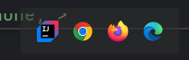

# Your Family Grocer – Full Stack E-Commerce PWA

## 📚 Table of Contents

- [Project Overview](#-project-overview)
- [Tech Stack](#-tech-stack)
- [Features](#-features)
- [Installation Run Instructions](#-installation-run-instructions)
- [Web Walk Through](#-web-walk-through)
- [Author](#-author)

---

## 📝 Project Overview

Your Family Grocer is a full-stack e-commerce application that allows users to browse products, manage their shopping cart, and place orders. The project demonstrates a modern web application using a Spring Boot backend and a Progressive Web App (PWA) frontend with JWT authentication.

The application supports:

- User registration and login
- Shopping cart functionality
- Checkout process with order placement
- Persistent user sessions via JWT
- Responsive PWA

---

## 🛠 Tech Stack

**Backend:**
- Java 17
- Spring Boot 3.x
- Spring Security (JWT)
- Spring Data JPA
- MySQL

**Frontend:**
- HTML, CSS, JavaScript
- Progressive Web App (PWA)
- Axios for API requests

**Development Tools:**
- IntelliJ IDEA
- Git / GitHub
- Maven
- Postman or browser for API testing

---

## ✨ Features

- **User Authentication:** Login, registration, and JWT-based secure sessions.
- **Product Catalog:** Browse products.
- **Shopping Cart:** Add items; dynamic cart total calculation.
- **Checkout:** Review cart items, see totals, and place orders.

---

## 🚀 Installation Run Instructions

### Backend

1. Clone the repository:

```bash
git clone https://github.com/praytoo/Capstone3-PWA.git
cd Capstone3-PWA
```
2. Configure application.properties for your local MySQL:

```
spring.datasource.url=jdbc:mysql://localhost:3306/groceryApp
spring.datasource.username=root
spring.datasource.password=your_password
server.port=8081
```
3. Build and run the backend:

```
mvn clean install
mvn spring-boot:run
```

4. The backend API should now run at http://localhost:8081

### Frontend

1. Open index.html and use intellij's pop up tab to load the browser



2. You can now interact with the PWA, add items to cart, and place orders.

---
## 🖼 Web Walk Through


---

## 👤 Author

Prince Haywood
Playa Vista, California
---